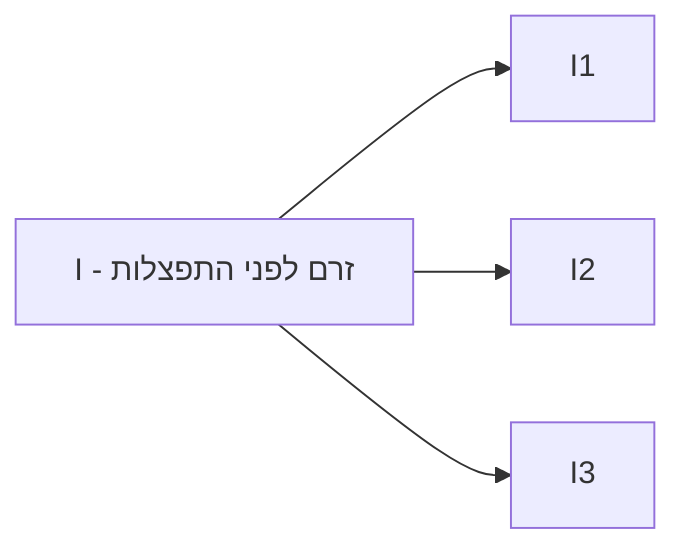
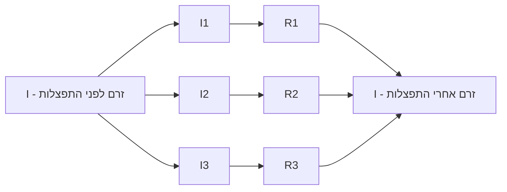
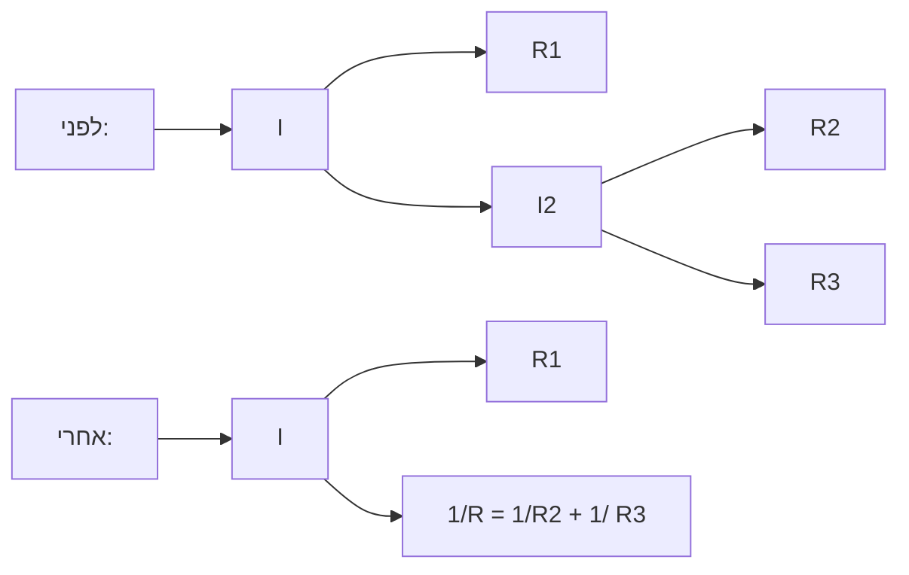
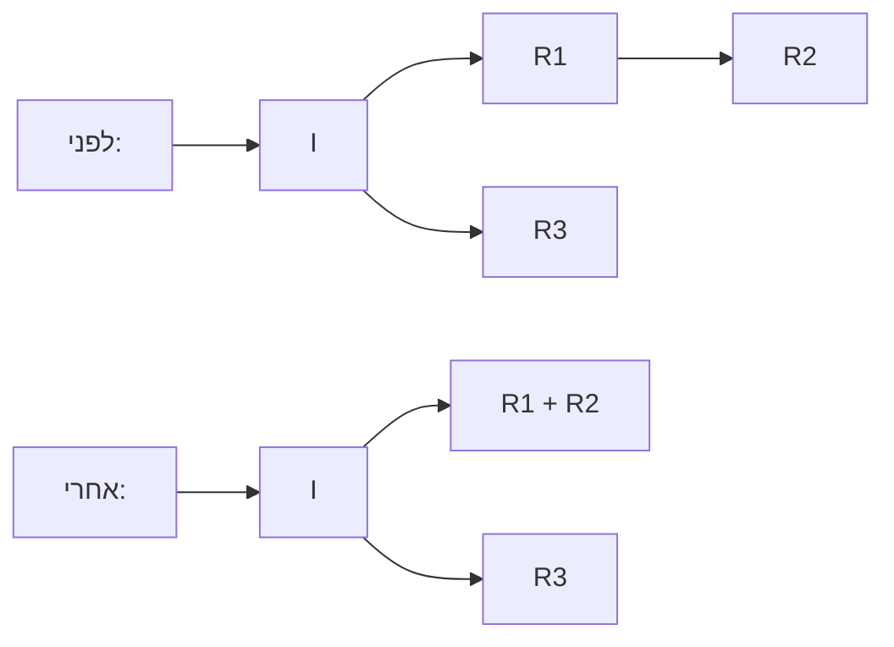

## הערות

 - יחידות מידה מיוצגות ע"י $[]$ (לדוגמה: $[m]$ - מטר)
 - יחידות משקל:
   - $m$ - מילי ($\frac{1}{1,000}$)
   - $µ$ - מיקרו ($\frac{1}{1,000,000}$)
   - $n$ - ננו ($\frac{1}{1,000,000,000}$)

---
# אלקטרוסטטיקה

### חוק קולון:

$\vec{F_E} = k \cdot\frac{q_1 \cdot q_2}{r^2}$

 - $k = 9 \cdot 10^9 \hspace{2px} [\frac{N \cdot m^2}{C^2}]$
 - $r$ - מרחק בין מטענים
 - $q_1, q_2$ - מטען חשמלי של כל אחד מהחלקיקים
---

### שדה חשמלי:
##### היחס בין הכוח החשמלי שהיה פועל על מטען נקודתי אילו היה נמצא בנקודה זאת, לבין אותו המטען:
$\vec{E} = \frac{\vec{F_c}}{q} = \frac{k \cdot q_{center}}{r^2}$

 - $F_c$ - ווקטור המייצג את הכוח שמופעל על המטען $q$ ע"י מרכז השדה (חוק קולון)
 - $q$ - גודל המטען $q$ (לפעמים, $q$ נוצר על ידנו, ונקרא "מטען בוחן", וניתן לא גודל שרירותי)
 - $[E] = \frac{[F_c]}{[q]} = [\frac{N}{C}]$ :יחידות מידה
 - $\vec{E} =\frac{vector}{scalar}$, ולכן  השדה החשמלי (בנקודה שבה בוחנים אותו) הוא וקטור

---
### כוח משיכת מטען אל שדה חשמלי

$\vec{F} = q \cdot \vec{E}$

 - $q$ - גודל המטען
 - $E$ - כוח השדה החשמלי 
 - $\vec{F} = m\cdot a$, ומכאן נובע:

$a = \frac{q \cdot \vec{E}}{m}$

 - $a$ - תאוצת המטען
 - $m$ - מסת המטען
---

### כוח שדה חשמלי על מטען

$\vec{F_{\vec{E_q}}} = \frac{k \cdot q_{center}}{r^2}$

 - $\vec{F_{\vec{E_q}}}$ - הכוח $\vec{F}$ שמשקיע השדה החשמלי $\vec{E}$ על המטען $q$. בהצגות אחרות של נוסחה זו, משתמשים לפעמים ב-$\vec{E}$ במקום.
 - $k = 9 \cdot 10^9 \hspace{2px} [\frac{N \cdot m^2}{C^2}]$
 - $q_{center}$ - מרכז השדה החשמלי
 - $r$ - המרחק שממנו מודדים את עוצמת השדה החשמלי 
   - $\lim_{r \rArr\infty} \rArr \frac{k \cdot q_{center}}{r^2} = \frac{k \cdot q_{center}}{\infty^2} \approx 0$ - ככל שהמרחק שממנו מודדים גדול יותר, המכנה גדל, וכך פחות כוח מושקע.
   - $\lim_{r \rArr 0} \rArr \frac{k \cdot q_{center}}{r^2} = \frac{k \cdot q_{center}}{0.00 \ldots1^2} \approx \infty$ - אותו הדבר מהצד השני - כשהמרחק שואף ל-0, יותר כוח מושקע
---

### כוח לוח חשמלי אינסופי על מטען

$\vec{E} = \frac{\sigma}{2 \cdot \epsilon _0}$

 - $\vec{E}$ - הכוח שמשקיע אותו לוח אינסופי על המטען
 - $\sigma$ - צפיפות המטען של אותו לוח חשמלי אינסופי.
	- $[\sigma] = [\frac{C}{m^2}]$ (היחס בין המטען בקולון לשטח הלוח במטר רבוע)
 - $\epsilon _0 = 8.85 \cdot 10^{-12}$ 
---

### אנרגיה חשמלית פוטנציאלית בין שני מטענים

$U_p = \frac{k \cdot q_1 \cdot q_2}{r}$

 - $U_p$ - האנרגיה הפוטנציאלית
 - $k = 9 \cdot 10^9 \hspace{2px} [\frac{N \cdot m^2}{C^2}]$
 - $r$ - מרחק בין מטענים
 - $q_1, q_2$ - מטען חשמלי של כל אחד מהחלקיקים

##### ניתן להגיע למשוואה זו בעזרת חישוב העבודה שנעשתה על מנת להגיע למצב שבו $q1$ ו$q2$ הם $r$ מטרים זה מזה. את העבודה ניתן לחשב ע"י אינטגרל של הכוח (שאותו נוכל להשיג מחוק קולון) לפי מרחק:

$W_{\vec{F_c}} = \int_r^\infty \frac{k \cdot q_1 \cdot q_2}{r^2}\\ \dArr \\ W_{\vec{F_c}} = \frac{k \cdot q_1 \cdot q_2}{r}\\\dArr\\ U_p = \frac{k \cdot q_1 \cdot q_2}{r}$

---
### כוח פוטנציאלי של שדה חשמלי

##### היחס בין הכוח הפןטנציאלי החשמלי שהיה פועל על מטען נקודתי אילו היה נמצא בנקודה זאת, לבין אותו המטען:
$V = \frac{U_p}{q}$

 - $U_p$ - סקלאר המייצג את האנרגיה החשמלית הפוטנציאלית בין מרכז השדה החשמלי למטען $q$ שיצרנו.
 - $q$ - גודל המטען $q$. בד"כ מטען בוחן שאנחנו יוצרים, ונתונים לו גודל שרירותי. הגודל שהכי קל לעבוד איתו הוא-1 קולון.
 - $[V] = \frac{[U_p]}{[q]} = [\frac{J}{C}]$ :יחידות מידה
---

### אנרגיה חשמלית כוללת

$\vec{U}_{system} = \Sigma \vec{U}$

 - $\vec{U}_{system}$ - האנרגיה החשמלית הקיימת במערכת.
 - $\Sigma \vec{U}$ סכום האנרגיות החשמליות המושקעות באותה מערכת. הסכום מורכב מכל זוגות המטענים הקיימים במערכת. מערכות חד מימדיות לדוגמה: (הקו מייצג ציר עליו המטענים נמצאים)
   - $–q_1–––q_2–––––q_3– \rArr \vec{U}_{system} = \vec{U}_{q_1q_2} + \vec{U}_{q_2q_3} + \vec{U}_{q_1q_3}$
   - $–q_1––––––q_2––q_3–q_4– => \vec{U}_{system} = \vec{U}_{q_1q_2} + \vec{U}_{q_1q_3} + \vec{U}_{q_1q_4} + \vec{U}_{q_2q_3} + \vec{U}_{q_2q_4} + \vec{U}_{q_3q_4}$
   - $Count(\Sigma \vec{U}) = \frac{n \cdot (n - 1)}{2}$ - כדי להיות בטוח שכללת את כל הזוגות האפשריים שיכולים להשפיע אחד על השני, אפשר לראות אם כמות הזוגות שהזכרת שווה ל-$\frac{n \cdot (n - 1)}{2}$. באופן כללי, הביטוי הזה משמש לדעת את כמות הזוגות היחודיים בתוך סדרה כלשהי.
---

# מעגלי זרם

### מציאת זרם בפרק זמן מסוים

$I = \frac{\Delta q}{\Delta t}$

 - $I$ - ערך הזרם החשמלי, נמדד באמפר.
 - $[I] = [\frac{\Delta q}{\Delta t}] = [\frac{c}{t}]$
 - $\Delta q$ - ההפרש בין גודל המטען החשמלי בין סוף המדידה לתחילת המדידה.
   - $q_2 - q_1$ שווה ערך ל
 - $\Delta t$ - זמן המדידה
---

### כמות אלקטרונים בנפח מסוים

$n_e \cdot e = \frac{\Delta q}{V}$

 - $n_e \cdot e$ כמות המטען החופשי בנפח מסוים, או, כמוהמטען החשמלי שמייצרים אלקטרונים בנפח מסוים. הכמות מחושב ע"י הכפלת:
   - $n_e$ - כמות האלקטרונים
   - $e$ - במשקל האלקטרון
 - $\Delta q$ - ההפרש בין גודל המטען החשמלי בין סוף המדידה לתחילת המדידה
 - $V$ - , כאשר $L \cdot A$ הנפח שבו אנו מודדים. גודל הפח שווה ל:
   - $L$ - אורך הכבל החשמלי בו אנו מודדים
   - $A = \pi \cdot r_{cable}^2$ - פריסת הכבל החשמלי, או, השטח של עיגול שרדיוסו רדיוס הכבל
---

### חוק אוהם

$I = \frac{V}{R}, V = I \cdot R$

 - $I$ - ערך הזרם החשמלי, נמדד באמפר.
 - $V$ - המתח החשמלי במעגל, נמדד בוולט.
 - $R$ - גודל התנגדות הנגד, נמדד באוהם ($\Omega$). ככל שההתנגדות גדלה, ערך הזרם החשמלי קטן
 - $[I] = [\frac{V}{R}] = [\frac{V}{\Omega}]$
---

### חוק הזרמים של קירכהוף

$I_{system} = I_1 + I_2 + I_3...$

 - $I_{system}$ - ערך הזרם החשמלי הראשי, לפני התפצלות
 - $I_1, I_2, I_3, ...$ - סכום הערכים של שאר הזרמים שהתפצלו מהזרת הראשי, I
---

### חוק המתחים של קירכהוף

$V_{system} = V_1 + V_2 + V_3...$

 - $V_{system}$ - כמות האנרגיה החשמלית שהמערכת טוענת כל חלקיק.
 - $V_1, V_2, V_3, ...$ - המתח שצורך כל אחד מהנגדים (או כל רכיב אחר) במעגל החשמלי.
---

### חוק קירכהוף + חוק אוהם

$I_T = \frac{V_T}{R_T}$

 - $I_T$ - סכום הערכים של הזרמים החשמליים אחרי ההתפצלות מהזרם הראשי.
 - $V_T$ - כמות האנרגיה החשמלית שהמערכת טוענת כל חלקיק. בד"כ שווה פשוט ל-V, המתח הראשי במעגל.
 - $R_T$ - סכום ההתנגדויות במעגל החשמלי, מכל הנגדים שנמצאים בה.
---

### מציאת התנגדות כוללת של מספר נגדים הרצים במקביל

$\frac{1}{R_{system}} = \frac{1}{R_1} + \frac{1}{R_2} + \frac{1}{R_3}...$

 - $R_{system}$ - ההתנגדות הכוללת של המעגל החשמלי, או ספציפית של החלק במעגל אותו אנו מודדים
 - $R_1, R_2, R_3...$ - הנגדים שנמצאים מיד אחרי הפיצול, כמו שמודגם בדיאגרמה למעלה.
  - במקרה שנמצאות כמה מערכות אחת בתוך השניה, יש לחשב קודם כל את המערכות הפנימיות ביותר, ולהשתמש בתוצאה כנגד בפני עצמו במשוואה החיצונית. דוגמה:

   - במקרה שנמצאים שני נגדים אחד אחרי השני, יש לסכום אותם, ולהשתמש בסכום במשוואה:

