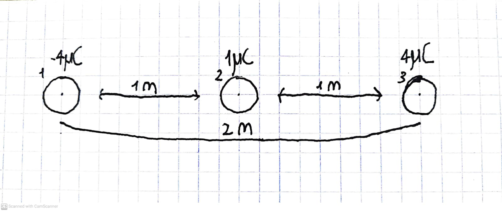

1. שני מטענים נקודתיים של 
$$q_3 = 4[\mu C] \\
q_1 = 4[\mu C]$$
נמצאים במרחק של 2 מטר זה מזה.

א. מהו הכוח השקול שיפעל על מטען שלישי של 
$$q_2 = 1[\mu C]$$
הנמצא במרחק של 1 מטר מכל אחד מהמטענים

ב. מהו הכוח השקול הפועל על המטען הימני ועל המטען השמאלי?

 
    
תשובה

    ..todo

---

2. שני מטענים נקודתיים של
$$
q_1 = 12[\mu C] \\ q_3 = 8[ \mu C] 
$$
נמצאים במרחק של 40 ס"מ זה מזה

א. היכן לאורך הקו המחבר ביניהם יש להניח מטען של
$$q_2 = 5[\mu C]$$
והוא ישאר במקום

 
    
תשובה

    א.

$$
F_1 = k \frac{q_1q_3}{r_1^2} = k \frac{12 \cdot 10^{-6} \cdot 5 \cdot 10^{-6}}{x^2} = \frac{6 \cdot 10^{-11}k}{x^2}
\\
F_2 = k \frac{q_2q_3}{r_2^2} = k \frac{5 \cdot 10^{-6} \cdot 8 \cdot 10^{-6}}{(40 - x)^2} = \frac{4 \cdot 10^{-11}k}{(40 - x)^2}
$$
$$
F_1 = F_2 \hspace{5px} \rArr \hspace{5px}  \frac{6 \cdot 10^{-11}k}{x^2} = \frac{4 \cdot 10^{-11}k}{(40 - x)^2}
\\
6 \cdot 10^{-11}k(40 - x)^2 = 4 \cdot 10^{-11}kx^2 \\
6 \cdot 10^{-11}k(1600 - 80x + x^2) = 4 \cdot 10^{-11}kx^2 \\
6 \cdot 10^{-11}k(1600 - 80x + x^2) = 4 \cdot 10^{-11}kx^2 \\
6k(1600 - 80x + x^2) = 4kx^2 \\
9600 - 480x + 6x^2 = 4x^2 \\
2x^2 - 480x + 9600 = 0 \\
$$
$x_1 = 217.979$ (נפסל - לא הגיוני, המרחק המקסימלי הוא 40)  
$x_2 = 22.02 \checkmark$ 

---

3. שלושה מטענים זהים נמצאים על הקדקודים של משולש שווה צלעות שאורך צלעו a. ערכי המטענים q1, q2 ו-q3 מוגדר כ-q. המרחק בין הקדקדים שווה ל-a.

א. מה יהיה גודל הכוח השקול על הקדקד q3?